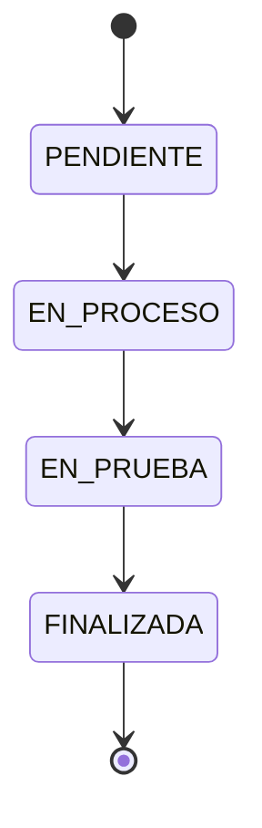
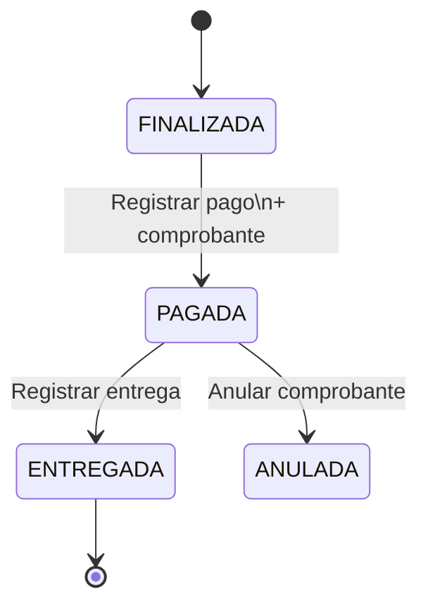
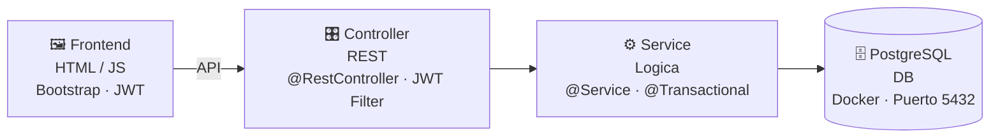

<div align="center">


<br>


<br><br>

**Sistema web completo de gestion de servicios e inventario para un taller mecanico automotriz.**
<br>
Interfaz de estilo industrial (acero, aceite, senalizacion), modo oscuro y animaciones fluidas.

</div>


## 📑 Contenido

| | | |
| :-- | :-- | :-- |
| [📁 Estructura](#-estructura-del-proyecto) | [🧰 Stack](#-stack-tecnologico) | [🚀 Como ejecutar](#-como-ejecutar) |
| [🎭 Casos de uso](#-modelo-de-caso-de-uso-de-negocio-actualizado) | [🔑 Credenciales](#-credenciales-de-prueba) | [🗄️ Datos semilla](#%EF%B8%8F-que-hay-en-la-base-de-datos-automatico) |
| [🔄 Flujo del negocio](#-flujo-del-negocio) | [🧾 Facturacion](#-facturacion-boletafactura--v130) | [🖥️ Pantallas](#%EF%B8%8F-pantallas-del-sistema) |
| [🏗️ Arquitectura](#%EF%B8%8F-arquitectura-del-sistema) | [🔒 Seguridad](#-seguridad) | [🎨 Tema y animaciones](#-tema-y-animaciones) |
| [🔌 API REST](#-api-rest-endpoints) | [🧬 Base de datos](#-modelo-de-base-de-datos-14-tablas) | [🛠️ Problemas comunes](#%EF%B8%8F-resolver-problemas-comunes) |


## 📁 Estructura del Proyecto

<details open>
<summary><b>Ver arbol de carpetas</b></summary>

```text
sistema-de-autogestion/
├── README.md                          ← ESTE ARCHIVO
├── CHANGELOG.md
├── docker-compose.yml
├── readme-assets/                     (banner.svg, divider.svg, flow.svg)
├── backend/
│   ├── Dockerfile
│   ├── pom.xml
│   ├── src/main/java/com/autogestion/
│   │   ├── AutogestionApplication.java
│   │   ├── config/                (Security, JWT, CORS, DataInitializer, EmpresaProperties)
│   │   ├── entity/                (30 entidades JPA)
│   │   ├── repository/            (18 repositorios Spring Data)
│   │   ├── service/               (14 servicios con logica de negocio)
│   │   ├── controller/            (17 controladores REST)
│   │   ├── dto/                   (37 request/response DTOs)
│   │   └── util/                  (AppTime, DocumentoValidator, NumeroALetras, Rangos, TicketPdf)
│   └── src/main/resources/db/migration/    (Flyway: V1 esquema inicial, V2 fiscal/inventario/gastos)
├── database/
│   └── Dockerfile                 (Imagen Postgres 16; el esquema lo versiona Flyway)
├── frontend/
│   ├── Dockerfile
│   ├── nginx.conf
│   ├── index.html                 (Login)
│   ├── css/
│   │   ├── styles.css             (Diseno principal ~1160 lineas)
│   │   ├── animations.css         (Animaciones, textures, skeletons)
│   │   └── redesign.css           (Rediseño v1.1.0: gradientes, chips, tour)
│   ├── js/
│   │   ├── api.js                 (Cliente API, navbar, helpers, permisos por rol)
│   │   ├── animations.js          (Transiciones, ripples, stagger)
│   │   ├── ui-kit.js              (Toasts, buscador Ctrl+K, tour guiado)
│   │   └── confirm-modal.js       (Modal de confirmacion reutilizable)
│   └── pages/
│       ├── dashboard.html         (Indicadores)
│       ├── recepcion.html         (Recepcion de vehiculos)
│       ├── cotizacion.html        (Diagnostico + Cotizacion)
│       ├── orden_trabajo.html     (Ordenes de trabajo)
│       ├── inventario.html        (Gestion de inventario)
│       ├── pago_entrega.html      (Pagos y entregas + boleta/factura)
│       ├── mecanico.html          (Panel mecanico)
│       ├── recepcionista.html     (Panel recepcionista)
│       ├── tutorial.html          (Tutorial interactivo)
│       └── acceso_denegado.html   (Pagina de error 403)
```

</details>


## 🧰 Stack Tecnologico

| Capa | Tecnologia |
| :-- | :-- |
| 🖼️ **Frontend** | HTML + CSS + JavaScript + Animaciones CSS custom |
| ⚙️ **Backend** | Java 17+ / Spring Boot 3 (Spring Web, Spring Data JPA, Spring Security) |
| 🗄️ **Base de datos** | PostgreSQL 16 (via Docker) |
| 🔐 **Autenticacion** | JWT (JSON Web Tokens) |
| 👥 **Roles** | `ADMIN` · `MECANICO` · `RECEPCIONISTA` · `ALMACENERO` |


## 🚀 Como Ejecutar

### Lo que necesitas

- **Docker** → https://docs.docker.com/get-docker/
- **Docker Compose** (viene incluido con Docker Desktop)

### Paso 1 — Levantar el sistema

```bash
cp .env.example .env   # opcional: ajusta claves y demo (nunca subas .env)
docker compose up --build
```

Esto construye e inicia 3 contenedores. Flyway crea/actualiza el esquema solo al arrancar el backend (conserva tus datos):

| Contenedor | Servicio | Puerto |
| :-- | :-- | :-- |
| `db` | PostgreSQL 16 | 5433 (host) → 5432 (contenedor) |
| `backend` | Spring Boot | 8080 |
| `frontend` | Nginx | 5500 |

> [!NOTE]
> Espera hasta que veas los logs de los contenedores iniciando.

### Paso 2 — Abrir el navegador

- **Frontend:** http://localhost:5500
- **Backend API:** http://localhost:8080/api

### Paso 3 — Iniciar sesion

- **Email:** `admin@sanmartin.pe`
- **Contrasena:** `Admin-2026*` (demo; cámbiala con `APP_ADMIN_PASSWORD` en tu `.env`)

### Paso 4 — Recorrer el flujo del negocio

```text
Login -> Dashboard -> Recepcion -> Cotizacion -> Ordenes de Trabajo -> Inventario -> Pago/Entrega
```


## 🎭 Modelo de Caso de Uso de Negocio (Actualizado)

Actores: **Cliente, Recepcionista, Mecanico, Administrador**.

> El Recepcionista es el actor clave que registra la llegada del cliente/vehiculo, inicia la recepcion y coordina el flujo inicial del taller.


## 🔑 Credenciales de Prueba

| Usuario | Email | Contrasena | Rol |
| :-- | :-- | :-- | :-- |
| Administrador | `admin@sanmartin.pe` | `Admin-2026*` | `ADMIN` |
| Luis Ramírez (Motor) | `mecanico1@sanmartin.pe` | `Meca-2026*` | `MECANICO` |
| Jorge Castillo (Frenos) | `jcastillo@sanmartin.pe` | `Meca-2026*` | `MECANICO` |
| Marco Delgado (Electricidad) | `mdelgado@sanmartin.pe` | `Meca-2026*` | `MECANICO` |
| Rosa Chávez | `recepcionista@sanmartin.pe` | `Recep-2026*` | `RECEPCIONISTA` |
| Pedro Quispe | `almacen@sanmartin.pe` | `Alma-2026*` | `ALMACENERO` |

> [!WARNING]
> Claves **distintas por rol** solo para demo local (v2.0.0). En producción define las tuyas en `.env` (`APP_ADMIN_PASSWORD`, `APP_SEED_PASSWORD_*`) y pon `APP_SEED_DEMO=false` para no sembrar datos de prueba.


## 🗄️ Que Hay en la Base de Datos (Automatico)

Con `APP_SEED_DEMO=true` (valor demo) se insertan automaticamente estos datos. Con `false` solo se crea el ADMIN de arranque:

| Dato | Cantidad |
| :-- | :-- |
| 👥 Usuarios | 6 (admin, 3 mecánicos con especialidad, almacén, recepción) |
| 🧑‍💼 Clientes | 5 (3 con DNI + 2 empresas con RUC válido) |
| 🚗 Vehiculos | 4 (Corolla, Accent, Sentra, Hilux) |
| 🛠️ Servicios | 8 (cambio de aceite, alineacion, frenos, etc.) |
| 📦 Productos | 12 (aceite, filtros, pastillas, discos, etc.) |

> [!IMPORTANT]
> Los datos se mantienen en PostgreSQL dentro del contenedor Docker. Si eliminas el volumen `pgdata`, se pierden y (con demo activado) se vuelven a insertar al reiniciar.


## 🔄 Flujo del Negocio

<div align="center">
  
</div>

<br>

```text
1. RECEPCION
   └-> Registrar cliente + vehiculo + problema reportado

2. DIAGNOSTICO
   └-> El mecanico describe los hallazgos tecnicos

3. COTIZACION
   └-> Seleccionar servicios y productos
   └-> El total se calcula automaticamente
   └-> Aprobar o rechazar

4. ORDEN DE TRABAJO
   └-> Se crea automaticamente al aprobar cotizacion
   └-> Se asigna a un mecanico
   └-> Se cambia de estado: PENDIENTE -> EN_PROCESO -> EN_PRUEBA -> FINALIZADA

5. EJECUCION
   └-> El mecanico registra productos usados
   └-> El stock se descuenta automaticamente (transaccion atomica)

6. PAGO Y ENTREGA
   └-> Se registra el pago (metodo + comprobante: BOLETA / FACTURA)
   └-> Boleta: DNI/CE/PAS + nombre. Factura: RUC 11 + razon social + direccion fiscal
   └-> Desglose: Subtotal + IGV (18%) + Total, con serie/numero correlativo
   └-> Se registra la entrega del vehiculo (bloqueada hasta tener pago con comprobante)
```

> [!NOTE]
> El comprobante actual es **interno / pre-electronico**: no hay integracion con SUNAT (sin PSE/OSE, sin QR SUNAT, sin envio a SUNAT). Ver [🧾 Facturacion](#-facturacion-boletafactura--propuesta-v130) para el diseno propuesto en v1.3.0.

Estados de la orden de trabajo:




## 🖥️ Pantallas del Sistema

| Pantalla | Descripcion |
| :-- | :-- |
| 🔐 **Login** | Split-screen: identidad de marca (izq) + formulario (der), toggle de temas |
| 📊 **Dashboard** | 4 indicadores animados + flujo visual + alertas de stock + accesos rapidos |
| 🧾 **Recepcion** | Wizard en 4 pasos (cliente con buscador, vehículo, problema, confirmar) + lista con filtros (v1.8.0) |
| 👥 **Clientes** | Buscador, filtros, ficha con visitas/vehículos/comprobantes, activar sin borrar (v1.8.0) |
| 💬 **Cotizacion** | Wizard Diagnóstico → Cotización → Aprobar, cálculo en vivo, mecánicos por carga (v1.9.0) |
| 🔧 **Ordenes de Trabajo** | Kanban por estado con buscador + reasignar mecánico + cobro directo (v1.9.0) |
| 📦 **Inventario** | Pestañas: stock con costo/margen, movimientos auditados, compra multi-línea, mermas, proveedores, alertas (v1.10.0) |
| 💳 **Pago/Entrega** | Ordenes finalizadas + resumen animado + wizard BOLETA/FACTURA con totales del servidor + ticket/PDF legítimos (emisor, detalle, IGV, letras, QR) + historial con filtros + anulación ADMIN (v1.5.0) |
| 👥 **Equipo** | Personal con nombre real, avatar de iniciales, especialidad y carga de OT; crear/editar/desactivar/restablecer clave (solo ADMIN, v1.7.0) |
| 📊 **Reportes** | 7 pestañas por rol (resumen, clientes, ingresos, inventario, gastos, resultado, mecánicos) con gráficos propios, CSV y fórmula visible (v1.11.0) |
| 🎓 **Tutorial y docs** | Caso guiado de 8 pasos, glosario, tours por pantalla + `docs/` (guía, manual, preguntas de defensa, v1.12.0) |


## 🧾 Facturacion (Boleta/Factura) — v1.3.0

> [!NOTE]
> **Implementado (v1.5.0, Fase 1)**: el comprobante vive en la BD (`comprobante` + `serie_comprobante` con bloqueo pesimista). El wizard de `pago_entrega.html` consume `POST /api/comprobantes`; el total sale de la cotización en el servidor. RUC con dígito verificador, IGV 18 %, total en letras, folio `F001-00000001`, QR y anulación con motivo (solo ADMIN). Comprobante académico: no firma XML ni envía a SUNAT.

### Gaps que quedan en backend

| # | Gap | Estado |
| :-- | :-- | :-- |
| 1 | `pago_entrega` sin `metodo_pago`, `tipo_comprobante`, `serie`, `numero`, `subtotal`, `igv` | ⏳ Pendiente (migracion `2026-10-01_comprobantes.sql`) |
| 2 | `cliente` sin `tipo_documento`, `razon_social`, `direccion_fiscal` | ⏳ Pendiente |
| 3 | `PagoRequest` solo lleva `monto` | ⏳ Pendiente (payload extendido) |
| 4 | `pago_entrega.html` sin selector ni constancia | ✅ Hecho en v1.3.0 frontend |
| 5 | `total` sin desglose Subtotal/IGV en servidor | ✅ Desglose en frontend (`total/1.18`); pendiente en BD |

### Boleta vs Factura en Peru

| | 🧾 **Boleta** | 🧾 **Factura** |
| :-- | :-- | :-- |
| **Para quien** | Consumidor final (persona natural) | Empresa / cliente que necesita credito fiscal |
| **Documento** | DNI (8) / CE / PAS | RUC (11) obligatorio |
| **Datos extra** | Solo nombre | Razon social + direccion fiscal obligatorias |
| **IGV** | Incluido en el total (se muestra referencial) | Desglosado: Subtotal + IGV 18% + Total |
| **Serie sugerida** | `B001` | `F001` |

### Flujo en `pago_entrega.html` (implementado)

```text
OT FINALIZADA
  └-> [Registrar Pago] abre modal:
       1. Tipo comprobante: (•) Boleta  ( ) Factura
       2. Documento: DNI 8 (boleta) o RUC 11 + razon social + direccion (factura)
       3. Metodo pago: EFECTIVO · YAPE · PLIN · TRANSFERENCIA · TARJETA
       4. Desglose auto: Subtotal + IGV 18% + Total (= cotizacion.total)
       5. [Confirmar pago] -> POST al backend + guarda comprobante local
  └-> Constancia automatica: ticket con serie/numero + [Imprimir]
  └-> Tarjeta muestra badge BOLETA B001-000123 o FACTURA F001-000045
  └-> [Registrar Entrega] sigue bloqueado hasta tener pago registrado
  └-> [Ver comprobante] reimprime la constancia en cualquier momento
```



### Cambios de datos y API (resumen)

```text
cliente  + tipo_documento (DNI/RUC/CE/PAS) + razon_social + direccion_fiscal
pago_entrega  + metodo_pago + tipo_comprobante (BOLETA/FACTURA) + serie + numero
              + subtotal + igv + total + dni_ruc_snapshot + razon_social_snapshot
              + estado_comprobante (EMITIDO/ANULADO)
```

| Metodo | Endpoint (propuesto) | Descripcion |
| :-: | :-- | :-- |
|  | `/api/pagos` (payload extendido) | Registrar pago con `metodo_pago` + `tipo_comprobante` + datos fiscales |
|  | `/api/comprobantes/{id}` | Obtener comprobante para reimprimir |
|  | `/api/comprobantes/serie` | Siguiente correlativo por serie (B001/F001) |

> [!WARNING]
> Alcance: comprobante **interno imprimible** (ticket/A4 con logo, serie/numero, detalle de servicios/productos, IGV y metodo de pago). **No** incluye facturacion electronica SUNAT (sin PSE/OSE, QR ni envio a SUNAT); eso seria una fase v2 con proveedor electronico.

Ver detalle de migracion y archivos a tocar en `CHANGELOG.md` → `[1.3.0]`.

### ✨ Funcionalidades visuales

- **Guia contextual** en cada pagina: banner "que hago aqui" en 3 pasos + boton al siguiente paso (v1.4.0, se puede ocultar)
- **Responsive real**: tablet a 2 columnas, navbar movil con scroll, modales adaptados (v1.4.0)
- **Modo oscuro/claro/sistema** con toggle flotante en todas las paginas
- **Animaciones de entrada escalonadas** (stagger) en indicadores, tablas y cards
- **Transiciones de pagina** tipo SPA-light al navegar entre secciones
- **Microinteracciones**: ripple en botones, pop en badges, elevacion en hover
- **Skeletons de carga** y estados vacios estilizados
- **Textura sutil tipo acero** en todas las superficies
- **Flujo visual** con dots animados (pulso) en pasos del proceso


## 🏗️ Arquitectura del Sistema




## 🔒 Seguridad

- **Autenticacion:** JWT (JSON Web Token)
- **Roles:** ADMIN, MECANICO, ALMACENERO, RECEPCIONISTA
- **Endpoints protegidos** por rol con `@RolesAllowed` (backend) + `ROLE_PAGES`/`ROLE_NAV` (frontend)
- **Passwords** hasheados con BCrypt, distintos por rol en demo
- **Secretos fuera del repo:** `.env` (ver `.env.example`); JWT, claves y demo por variables. Consola H2 solo en desarrollo
- **Estados tipados:** `EstadoOT`, `EstadoRecepcion`, `EstadoCotizacion` (mismo texto en BD, sin estados imposibles)

### Permisos por Rol

| Rol | Puede hacer |
| :-- | :-- |
| 🛡️ **ADMIN** | Dashboard, recepcion, cotizacion, ordenes, inventario, pago/entrega, comprobantes (emitir + anular), reportes |
| 🔧 **MECANICO** | Panel Mecanico, sus ordenes de trabajo (cambio de estado), inventario en lectura |
| 🧾 **RECEPCIONISTA** | Panel Recepcionista, recepcion, cotizacion, ordenes de trabajo, pago/entrega (emitir comprobantes; anular es solo ADMIN) |
| 📦 **ALMACENERO** | Dashboard, inventario (productos, movimientos, alertas de stock) |


## 🎨 Tema y Animaciones

### Cambiar tema

Haz click en el boton flotante (esquina inferior derecha) para ciclar:

- **Sistema** (sigue el tema del SO)
- **Claro**
- **Oscuro**

La preferencia se guarda en `localStorage` y persiste entre sesiones.

### Animaciones

Todas las animaciones se desactivan automaticamente si el SO tiene activado `prefers-reduced-motion`. Puedes probarlo en:

- **Windows:** Configuracion > Accesibilidad > Efectos visuales > Animaciones
- **Mac:** Sistema > Accesibilidad > Pantalla > Reducir movimiento

### Helpers JS (consola del navegador)

```js
agSkeleton(container, 'table')    // Muestra skeleton de carga
agEmptyState(container, null, 'Sin datos', 'Descripcion')  // Estado vacio
agFlashRow(tableRow)              // Resalta una fila momentaneamente
```


## 🌐 URLs del Sistema

| Servicio | URL |
| :-- | :-- |
| Frontend | http://localhost:5500 |
| Backend API | http://localhost:8080/api |


## 🔌 API REST Endpoints

<details open>
<summary><b>Ver los 23 endpoints</b></summary>

<br>

| Metodo | Endpoint | Descripcion |
| :-: | :-- | :-- |
|  | `/api/auth/login` | Autenticacion (devuelve JWT) |
|  | `/api/clientes` | Crear cliente (valida DNI/RUC/CE/pasaporte) |
|  | `/api/clientes` | Listar clientes |
|  | `/api/clientes/buscar?q=` | Buscar paginado por documento, nombre, teléfono o email |
|  | `/api/clientes/{id}` | Editar cliente (chequea duplicado) |
|  | `/api/clientes/{id}/vehiculos` | Vehículos de un cliente |
|  | `/api/clientes/{id}/resumen` | Ficha con visitas, historial y comprobantes |
|  | `/api/clientes/{id}/activo` | Desactivar/activar sin borrar |
|  | `/api/vehiculos` | Crear vehiculo (placa peruana, un dueño por placa) |
|  | `/api/vehiculos` | Listar vehiculos |
|  | `/api/recepciones` | Crear recepcion |
|  | `/api/recepciones` | Listar recepciones (filtro por estado) |
|  | `/api/diagnosticos` | Crear diagnostico |
|  | `/api/cotizaciones` | Crear cotizacion |
|  | `/api/cotizaciones` | Listar cotizaciones |
|  | `/api/cotizaciones/{id}/aprobar` | Aprobar cotizacion |
|  | `/api/cotizaciones/{id}/rechazar` | Rechazar cotizacion |
|  | `/api/ordenes-trabajo` | Crear orden de trabajo |
|  | `/api/ordenes-trabajo` | Listar OT |
|  | `/api/ordenes-trabajo/{id}/estado` | Cambiar estado de OT |
|  | `/api/ordenes-trabajo/{id}/mecanico` | Reasignar mecánico (OT abierta) |
|  | `/api/ordenes-trabajo/{id}/productos-usados` | Registrar producto usado |
|  | `/api/productos` | Listar productos |
|  | `/api/productos` | Crear producto |
|  | `/api/inventario/movimientos` | Registrar movimiento (entrada con costo, consumo, ajustes, merma) |
|  | `/api/inventario/alertas` | Obtener alertas de stock bajo |
|  | `/api/inventario/movimientos?tipo=&desde=&hasta=` | Kardex paginado con filtros |
|  | `/api/proveedores` | Crear proveedor (RUC validado) |
|  | `/api/gastos` | Registrar gasto operativo (solo ADMIN) |
|  | `/api/reportes/clientes-por-dia` | Clientes atendidos por día (+ `/export?formato=csv`) |
|  | `/api/reportes/ingresos?agrupar=dia\|mes` | Ingresos cobrados (solo EMITIDO) |
|  | `/api/reportes/resultado` | Utilidad = sin IGV − consumos − gastos |
|  | `/api/reportes/inventario/kardex/{id}` | Kardex con saldos que cuadran |
|  | `/api/reportes/rendimiento-mecanicos` | OT, tiempos y consumo por mecánico |
|  | `/api/pagos` | Registrar pago (flujo antiguo, se mantiene) |
|  | `/api/comprobantes` | Emitir boleta/factura (monto desde cotización) |
|  | `/api/comprobantes` | Listar con filtros y paginación |
|  | `/api/comprobantes/previsualizar` | Totales y adquirente sin reservar número |
|  | `/api/comprobantes/{id}/anular` | Anular con motivo (solo ADMIN) |
|  | `/api/ordenes-trabajo/{id}/comprobante` | Comprobante vigente de una OT |
|  | `/api/documentos/validar` | Validar DNI/RUC/CE/pasaporte en vivo |
|  | `/api/entregas/{id}` | Registrar entrega |
|  | `/api/reportes/indicadores` | Obtener indicadores del dashboard |

</details>


## 🧬 Modelo de Base de Datos (14 tablas)

```text
usuario ──────────┐
                   │
cliente ──┐        │   (+ tipo_documento, razon_social, direccion_fiscal en v1.3.0)
          │        │
vehiculo ─┘        │
      │            │
recepcion ─────────┤
      │            │
diagnostico ───────┤
      │            │
servicio ──────────┤
      │            │
producto ──────────┤
      │            │
cotizacion ────────┤
   ├── cotizacion_servicio
   └── cotizacion_producto
      │
orden_trabajo ─────┤
   └── ot_producto_usado
      │
inventario_movimiento
      │
pago_entrega  (+ metodo_pago, tipo_comprobante BOLETA/FACTURA, serie/numero, subtotal/igv/total en v1.3.0)
```

> [!TIP]
> v1.3.0: el pago genera comprobante interno (serie `B001`/`F001` + correlativo + snapshot fiscal) con constancia imprimible. Detalle en [🧾 Facturacion](#-facturacion-boletafactura--v130) y en `CHANGELOG.md`.


## 🛠️ Resolver Problemas Comunes

<details>
<summary><b>"Puerto 8080 ya en uso"</b></summary>

<br>

Cierra otras aplicaciones que puedan estar usando ese puerto, o cambia el puerto en `docker-compose.yml`:

```yaml
backend:
  ports:
    - "8081:8080"
```

</details>

<details>
<summary><b>"Docker no encontrado"</b></summary>

<br>

Instala Docker Desktop desde https://docs.docker.com/get-docker/

</details>

<details>
<summary><b>"Los contenedores no inician"</b></summary>

<br>

Verifica que Docker este corriendo. Puedes revisar los logs con:

```bash
docker compose logs
```

</details>

<details>
<summary><b>"Los datos se perdieron"</b></summary>

<br>

Si eliminaste el volumen `pgdata`, se pierden los datos. Al reiniciar Docker se vuelven a insertar automaticamente.

</details>

<details>
<summary><b>"Schema-validation: missing column" en bucle (v1.5.1+ ya no pasa)</b></summary>

<br>

Desde la v1.5.1 Flyway aplica solo las migraciones pendientes al arrancar (`baseline` en BD existentes). Si ves este error en una versión vieja: actualiza el código y haz `docker compose up --build` (sin `-v`, no pierdes datos). Solo usa `docker compose down -v` si aceptas borrar todo.

</details>

<details>
<summary><b>"FlywayException: Unsupported Database: PostgreSQL" (resuelto en 2.0.0)</b></summary>

<br>

Flyway 10 trae el soporte por BD en módulos aparte: sin `flyway-database-postgresql` en el `pom` el backend no arranca en Docker (en H2 local sí, por eso los tests pasaban). Ya viene incluido; si lo ves, es que tu código es anterior a la 2.0.0.

</details>

<details>
<summary><b>"Recibo 403 o error CORS"</b></summary>

<br>

Asegurate de que:

1. El frontend se sirve por HTTP (no `file://`)
2. El backend esta corriendo en el puerto 8080
3. Usas `http://localhost:5500` (no doble clic al HTML)

</details>

<br>

<div align="center">


**Desarrollado para el taller mecanico automotriz**

</div>
