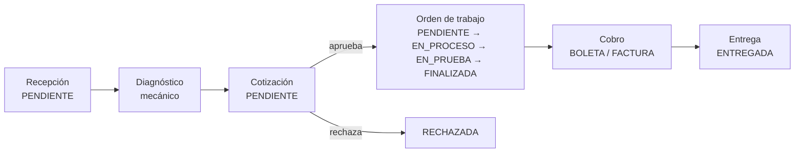
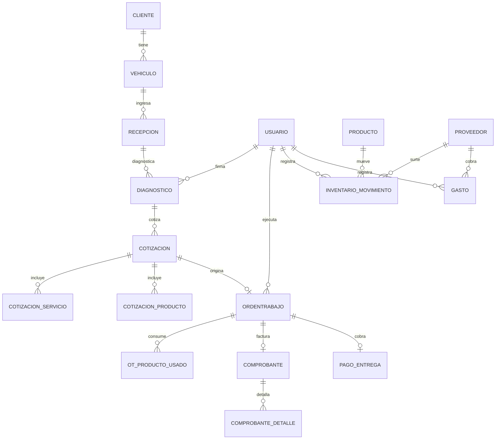
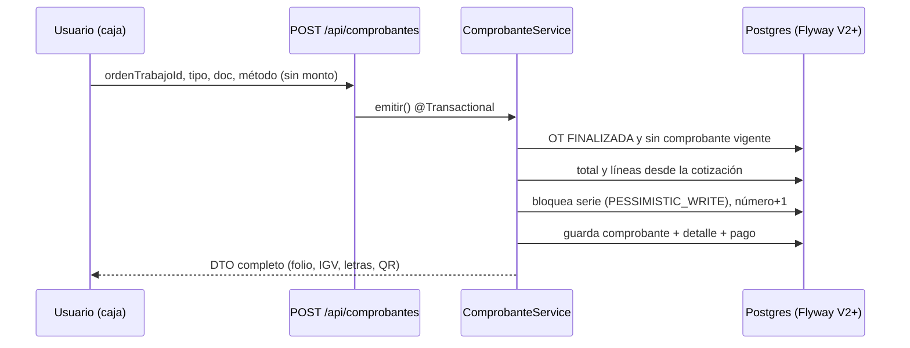

# Guía de desarrollo — AutoGestion

Cómo está construido el sistema, fase por fase. Si defiendes el proyecto, lee este archivo primero.

## Índice por fase

| Fase | Versión | Qué se hizo y por qué |
| :-- | :-- | :-- |
| 0–1.4 | 1.0.0–1.4.2 | Base: taller funcional, roles, rediseño visual, wizard de pago con constancia |
| 1 | 1.5.0 | Comprobantes en backend (series, RUC, IGV, API) + Flyway 1.5.1 |
| 2 | 1.6.0 | Identidad por documento, sin fusiones, `@Valid` real |
| 3 | 1.7.0 | Equipo con nombre real y selects por carga |
| 4 | 1.8.0 | Recepción en 4 pasos + panel de clientes |
| 5 | 1.9.0 | Kanban de OT, cotización guiada, consumo unificado |
| 6 | 1.10.0 | Compras con costo, mermas auditadas, gastos |
| 7 | 1.11.0 | Reportes con agregaciones + `AppTime` Lima |
| 8 | 1.12.0 | Didáctica: glosario, caso guiado, tours, estos docs |
| 9 | 2.0.0 | Secretos por entorno, H2 solo dev, enums unificados |

## Flujo del taller



## Modelo entidad-relación (resumen)



## Secuencia: emitir un comprobante



## Decisiones que debes poder explicar

1. **Flyway, no `ddl-auto=update`.** Las migraciones versionadas se aplican solas al arrancar, también en BD con datos (baseline). Regla: nunca editar una migración aplicada.
2. **`BigDecimal`, nunca `double`, para dinero.** `0.1 + 0.2` en coma flotante no es `0.3`; en soles eso son centavos perdidos.
3. **El monto lo calcula el servidor.** Lo que envía el navegador se ignora: si el total viniera del frontend, cualquiera cobraría S/ 0.01 con DevTools.
4. **Snapshot en el comprobante.** Se copian emisor y adquirente al emitir: la factura es una foto de ese día, aunque el cliente cambie después.
5. **`AppTime` (America/Lima).** Un solo reloj para que "hoy" signifique lo mismo en el servidor y en los reportes.
6. **Soft delete.** Desactivar conserva la historia; borrar la rompería.
7. **Errores `{mensaje, campo, sugerencia}`.** El backend habla humano y dice en qué campo y cómo corregirlo; el frontend enfoca ese campo.
8. **Sin `localStorage` para negocio.** Solo preferencias (tema, guías cerradas). Los datos viven en la BD o se pierden entre PCs.
9. **Representación académica, no electrónica.** Estructura y reglas SUNAT reales, pero sin firma XML ni envío: el pie siempre lo dice.

## Cómo probar

```bash
docker compose up --build     # todo (Postgres + Flyway solas)
docker run --rm -v "$PWD/backend:/app" -w /app maven:3.9-eclipse-temurin-17 mvn -B test
```

BD con datos viejos: arranca normal, Flyway aplica lo pendiente (ver `flyway_schema_history`). Solo `down -v` si aceptas perder todo.
